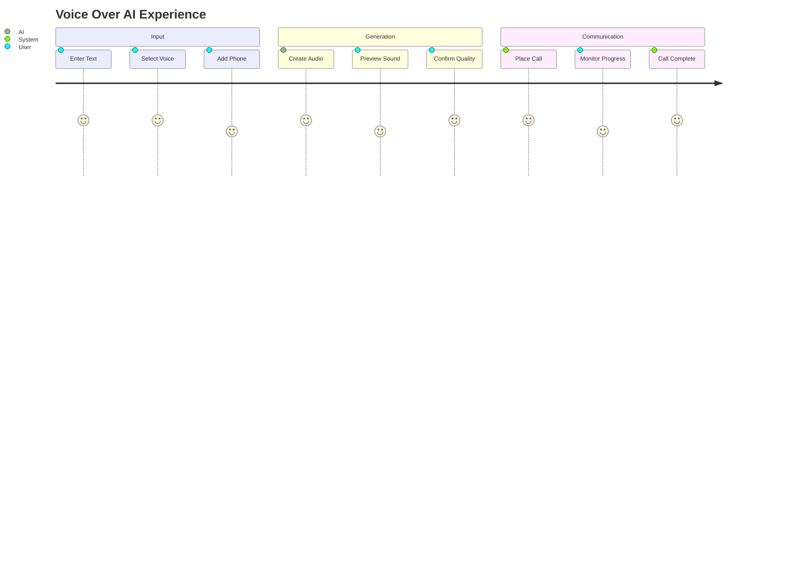

# Voxis-Voice Over AI Agent

<div align="center">


*Advanced AI-powered voice generation with seamless telephony integration*

---

**Transform text into lifelike speech and deliver it through intelligent phone calls**

[](https://reactjs.org/)
[](https://nodejs.org/)
[](https://www.typescriptlang.org/)
[](https://elevenlabs.io/)

</div>

---

## ✨ **What Makes This Special**

> A revolutionary web application that bridges the gap between AI-generated voices and real-world communication through intelligent telephony integration.

### 🚀 **Core Capabilities**


- **🎭 AI Voice Orchestra** - Choose from a symphony of ElevenLabs AI voices
- **📞 Smart Telephony** - Seamless integration with Exotel calling platform
- **⚡ Real-time Magic** - Watch your text transform into calls with live progress tracking
- **🎵 Audio Preview** - Listen before you call with built-in audio playback
- **📱 Universal Design** - Beautiful, responsive interface that works everywhere
- **🛡️ Bulletproof Architecture** - Comprehensive error handling and simulation modes

---

## 🖼️ **Experience the Interface**

<div align="center">

### Main Dashboard


### Advanced Controls


</div>

---

## 🛠️ **Technology Ecosystem**

<div align="center">

### Frontend Powerhouse
```
React 18 + Modern CSS3 + Font Awesome Icons
```

### Backend Excellence  
```
Node.js + Express + TypeScript + Advanced Security
```

### AI & Telephony Partners
```
🤖 ElevenLabs TTS API    📞 Exotel Cloud Platform
```

</div>

---

## 🏗️ **Project Architecture**

```
🏠 voice-over-ai-agent/
├── 🖥️  backend/                 # Powerful Node.js engine
│   ├── 🔧 src/services/        # External API magic
│   │   ├── 🎤 elevenLabs.ts    # Voice generation service  
│   │   └── 📞 exotel.ts        # Telephony service
│   ├── 🛣️  routes/             # API highways
│   ├── 🎵 audio/               # Generated voice storage
│   └── ⚙️  dist/               # Compiled excellence
├── 🎨 frontend/                # Beautiful React interface
│   ├── 📱 src/App.js          # Main application
│   ├── 🎨 index.css          # Stunning styles
│   └── 🌐 public/            # Static assets
└── 📖 README.md              # You are here!
```

---

## 🚀 **Quick Start Journey**

### **Prerequisites Checklist**
- ✅ Node.js (v16+)
- ✅ Package manager (npm/yarn)
- ✅ ElevenLabs account (optional for demo)
- ✅ Exotel account (optional for real calls)

---

### **Installation Symphony**

#### 🎵 **Movement I: Backend Setup**
```bash
# Enter the backend realm
cd backend

# Install the magic
npm install

# Configure your secrets
cp .env.example .env
# ✏️ Edit .env with your API keys

# Build the foundation
npm run build
```

#### 🎨 **Movement II: Frontend Setup**
```bash
# Navigate to the visual experience
cd frontend

# Install dependencies
npm install --legacy-peer-deps
```

#### ⚡ **Movement III: Launch Sequence**
```bash
# Backend Symphony (Terminal 1)
cd backend && npm run dev
# 🌐 Backend harmonizing on localhost:3001

# Frontend Overture (Terminal 2)  
cd frontend && npm start
# 🎨 Frontend dancing on localhost:3000
```

---

## 🔐 **Configuration Secrets**

### **Environment Variables Magic**
```env
# 🎤 Voice Generation Power
ELEVENLABS_API_KEY=your_magical_key_here

# 📞 Telephony Excellence (Optional)
EXOTEL_API_KEY=your_calling_key_here
EXOTEL_API_TOKEN=your_secure_token_here
EXOTEL_SID=your_unique_identifier_here
EXOTEL_VIRTUAL_NUMBER=your_virtual_number_here

# Alternative: Twilio Integration
TWILIO_ACCOUNT_SID=your_twilio_sid_here
TWILIO_AUTH_TOKEN=your_twilio_token_here
TWILIO_PHONE_NUMBER=your_twilio_number_here
```

> 💡 **Pro Tip**: No API keys? No problem! The app runs in full simulation mode with all features working perfectly.

---

## 🎯 **User Journey Map**

<div align="center">



</div>

### **Step-by-Step Magic**

1. **🖊️ Craft Your Message** - Type the text that will become voice
2. **🎭 Choose Your Voice** - Select from AI voice personalities  
3. **📱 Set Destination** - Enter the phone number to call
4. **⚡ Generate & Connect** - Watch the magic happen in real-time
5. **📊 Monitor & Enjoy** - Track progress and listen to results

---

## 🌐 **API Ecosystem**

### **Voice Intelligence Endpoints**
- `🎤 GET /api/voice/voices` - Discover available voices
- `🔊 POST /api/voice/generate` - Transform text to speech
- `🧪 POST /api/voice/test` - Test voice generation
- `🧹 GET /api/voice/cleanup` - Maintain audio library

### **Telephony Command Center**
- `📞 POST /api/call/place` - Launch intelligent calls
- `📊 GET /api/call/status/:callId` - Real-time call monitoring
- `🔄 POST /api/call/complete` - Complete workflow integration
- `✅ GET /api/call/verify` - Validate telephony credentials

### **System Health Hub**
- `💓 GET /health` - System wellness check
- `🎵 /audio/*` - Audio file delivery

---

## 🎭 **Simulation Mode Excellence**

**Experience full functionality without any setup!**

When API credentials aren't configured, the application seamlessly transforms into a comprehensive simulation environment:

- **🎯 Mock Voice Library** - Realistic voice options for testing
- **🔊 Audio Generation** - Creates demonstration audio files
- **📞 Call Simulation** - Full call lifecycle without real calls
- **📊 Status Theater** - Authentic progress indicators and updates
- **✨ Complete Experience** - Every feature works as designed

*Perfect for demonstrations, development, and exploration!*

---

## 🛡️ **Security & Performance**

<div align="center">

| Feature | Implementation |
|---------|----------------|
| 🔐 **CORS Protection** | Frontend domain security |
| ✅ **Input Validation** | Server-side sanitization |
| ⚡ **Rate Limiting** | API abuse prevention |
| 🛡️ **Error Handling** | Secure error responses |
| 🧹 **Auto Cleanup** | Intelligent file management |
| 🔒 **Credential Security** | Environment-based config |

</div>

---

## 🧪 **Testing Your Installation**

### **Quick Health Checks**

```bash
# Test voice generation
curl -X POST http://localhost:3001/api/voice/test \
     -H "Content-Type: application/json" \
     -d '{"text": "Hello World", "voice_id": "mock-voice-1"}'

# Verify system health  
curl http://localhost:3001/health

# Explore available voices
curl http://localhost:3001/api/voice/voices
```

### **Frontend Validation**
- 🌐 Open browser console for detailed insights
- 📝 Test various text lengths and formats
- 🎭 Experiment with different voice selections  
- 📊 Monitor network requests in developer tools

---

## 📊 **Monitoring & Intelligence**

**Comprehensive observability built-in:**

- **📝 Request Chronicles** - Complete HTTP request logging
- **🚨 Error Intelligence** - Detailed error tracking and analysis
- **⚡ Performance Metrics** - Response times and system health
- **🔗 API Connectivity** - External service status monitoring
- **📁 File Operations** - Audio lifecycle management

---

## ⚠️ **Known Boundaries**

### **Current Scope**
- **🎵 Audio Format**: MP3 optimization
- **📝 Text Limits**: Optimized for standard message lengths
- **💾 Storage**: Local file system (cloud-ready architecture)
- **📞 Phone Validation**: Universal format support
- **⚡ Concurrency**: Single-threaded call processing

### **Design Assumptions**
- Modern browsers with HTML5 audio capabilities
- Stable network connectivity for API interactions  
- Valid phone numbers for testing scenarios
- Sufficient local storage for temporary audio files
- ElevenLabs account with adequate credits (when used)

---

## 🔧 **Troubleshooting Guide**

<details>
<summary><b>🚀 Backend Issues</b></summary>

- **Port Conflicts**: Ensure port 3001 is available
- **Dependencies**: Run `npm install` in backend directory
- **Environment**: Verify `.env` file format and location

</details>

<details>
<summary><b>🎨 Frontend Issues</b></summary>

- **Connection Problems**: Confirm backend is running on port 3001
- **CORS Errors**: Check proxy settings in package.json
- **Build Issues**: Try `npm install --legacy-peer-deps`

</details>

<details>
<summary><b>🎤 Voice Generation Issues</b></summary>

- **API Key Problems**: Verify ElevenLabs API key validity
- **Network Issues**: Check internet connectivity
- **Quota Limits**: Review API usage limits

</details>

<details>
<summary><b>📞 Telephony Issues</b></summary>

- **Credential Verification**: Confirm Exotel/Twilio credentials
- **Phone Format**: Ensure proper international formatting
- **Account Balance**: Verify sufficient credits for real calls

</details>

---

## 🚀 **Production Deployment**

**Ready for the big stage? Consider these enhancements:**

- **🔐 Environment Security** - Production-grade API key management
- **🏗️ Build Optimization** - Full production builds for maximum performance
- **⚙️ Process Management** - PM2 or Kubernetes orchestration
- **🌐 Web Server** - Nginx or Apache reverse proxy configuration  
- **🔒 SSL/TLS** - HTTPS encryption for secure communications
- **💾 Database Integration** - Persistent storage for logs and analytics
- **☁️ Cloud Storage** - AWS S3 or similar for audio file management
- **🚀 CDN Integration** - Global audio delivery optimization

---

## 🎯 **What This Demonstrates**

<div align="center">

### **Technical Excellence**
```
Full-Stack Mastery • API Integration Expertise • Real-time Systems
```

### **User Experience Innovation**
```  
Intuitive Design • Progressive Enhancement • Error Recovery
```

### **Professional Development**
```
Production Architecture • Security Best Practices • Scalable Design
```

</div>

This Voice Over AI Agent represents a complete fusion of modern web development, artificial intelligence, and cloud communication technologies. It showcases advanced integration patterns, user-centric design principles, and production-ready architecture that scales with real-world demands.

---

<div align="center">

**🌟 Ready to transform text into intelligent conversations? Start your journey above! 🌟**

---

*Built with passion for seamless AI-human communication*

[](https://github.com/Ridh1234/Voxis)
[](#)
[](#)

</div>
